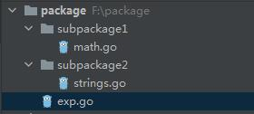

# 包package和模块Module

## package定义

package本质上就是一个目录，目录里包含有一个或者多个Go源程序文件，或者package。也就是说package里面还可以嵌套包含子package。

每个Go源文件都属于一个package，在源文件开头指定package名称

```go
package package_name
```

package的代码结构示例如下：



package里的变量、函数、结构体、方法等如果要被本package外的程序引用，需要在命名的时候首字母大写。

如果首字母小写，那就只能在同一个package里面被使用。

**注意**：这里说的是同一个package，不是同一个文件。同一个package下，如果有多个源程序文件是声明的该package，那这些源程序文件里的变量、函数、结构体等，即使不是首字母大写，也可以互相跨文件直接调用，不用额外import。

package的使用分为4类情况：

* 使用Go标准库自带的package，比如fmt。
* 使用go get获取到的第三方package/module
* 使用项目内部的package
* 使用其它项目的package/module


## import语法示例

### 普通

```go
import (
	"fmt"                           // 标准库
	"sync/atomic"                   // 标准库sync的atomic子package
	"package1"                      // 自开发的package
	"package2/package21"            // 自开发package，嵌套子package
	"package2/package22"            // 自开发package，嵌套子package
	"package3/package31/package311" // 自开发package，多重嵌套
)
```

使用import路径里面定义的**package名称**来访问package里的方法，结构体等，而不是路径名称。

举个例子，假设上面import的路径package2/package21这个目录下的Go源程序文件开头声明的package名称是realpackage，那访问这个package里的方法，结构体等要用realpackage.xxx来访问，而不是用package21.xxx来访问。

一句话总结：**import的是路径，访问用package名称**。最佳实践就是让两者保持一致。

### 别名

```go
import (
    "fmt"
    newName "package2/package21"
)
```

可以用别名newName来访问package里的成员，newName.xxx。这个在包名很长或者包名有重复的时候可以用到。

### 点操作

```go
import (
    "fmt"
    . "package2/package21"
)
```

` . `可以让后面的package里的成员注册到当前包的上下文，这样就可以直接调用成员名，不需要加包前缀了。

比如以前要用package21.Hello()来调用package21这个包里的函数Hello，用了点操作后，可以直接调用函数Hello()，前面不用跟package名称。


### 下划线

```go
import (
    "fmt"
    _ "package2/package21"
)
```

下划线` _ `的效果：只会执行包里各个源程序文件的init方法，没法调用包里的成员。


## Go如何寻找import的package

在代码里import某个package的时候，Go是如何去寻找对应的package呢？这个和Go环境变量GO111MODULE有关系。GO111MODULE的值可以通过如下命令查到

```go
go env | grep GO111MODULE
```

on表示开启，off表示关闭。GO111MODULE是从Go 1.11开始引入，在随后的Go版本中Go Modules的行为有一些变化，具体可以参考[GO111MODULE and Go Modules](https://maelvls.dev/go111module-everywhere/#go111module-with-go-116)。

下面以Go1.16及以上版本详细讲下GO111MODULE关闭和开启的情况下，Go是如何寻找import的package的。

### 关闭GO111MODULE

* 先从$GOROOT/src里找。$GOROOT是Go的安装路径，$GOROOT/src是Go标准库存放的路径，比如fmt, strings等package都存放在$GOROOT/src里。$GOROOT的路径可以通过下面的命令查看到：

  ```go
  go env | grep ROOT // linux or mac
  go env | findstr ROOT // windows
  ```

* 如果从$GOROOT/src找不到，再从$GOPATH/src里找。$GOPATH是安装Go后就会有的一个环境变量，Linux和Mac的默认路径是/Users/用户名/go，WIndows默认路径是C:/Users/用户名/go

  ```go
  go env | grep PATH // linux or mac
  go env | findstr PATH // windows
  ```

  在Go 1.11之前，还没有Go Modules，如果想import一些自己开发的package，被import的package必须建在$GOPATH/src路径下。一般而言，一个工程项目一定会有自己写的若干个package，因此这也导致工程项目本身也通常建在了$GOPATH/src路径下。

### 开启GO111MODULE

Go 1.11开始，有了Go Modules，工程项目可以建在任何地方，代码在import某个package的时候，会按照如下顺序寻找package：

* 先从$GOROOT/src/路径找。(Go标准库会在这个路径找到)

* 再从$GOPATH/pkg/mod/路径找。(Go第三方库会在这个路径找到)

* 如果都找不到，再看当前项目有没有go.mod文件，有的话就从go.mod文件里指定的模块所在路径往下找。如果没有go.mod文件，那就直接提示package xxx is not in GOROOT。(自己开发的本地库可以通过这个方式找到)

  

官方推荐使用Go Modules，从Go1.16版本开始，GO111MODULE环境变量默认开启为on模式。


## 使用示例

### 不开启GO111MODULES时import package

1. 项目建在$GOPATH/src下面
2. import package的时候路径从$GOPATH/src往下找

使用说明参考[gopath package demo](https://github.com/jincheng9/go-tutorial/tree/main/workspace/lesson27/gopath/)


### 开启GO111MODULES时import本项目里的package

1. 项目可以建在任何地方

2. 在项目所在根目录创建go.mod文件, module_name是模块名称

   ```go
   go mod init module_name
   ```

3. import项目本地的package时指定go.mod文件里的模块名称

   比如module_name叫project，在这个模块里，main.go使用了本项目里的util包，那在main.go里按照如下格式import这个package

   ```go
   import "project/util" // project是模块名称, util是这个模块下的本地package
   ```

使用说明参考[module package demo](https://github.com/jincheng9/go-tutorial/tree/main/workspace/lesson27/module)


### 开启GO111MODULES时import第三方开发的Module

1. 项目可以建在任何地方

2. 在项目所在根目录创建go.mod文件

   ```go
   go mod init module_name
   ```

3. 下载所需第三方Module，比如gin

   ```go
   go get -u github.com/gin-gonic/gin
   ```

4. 代码里import对应的Module

   ```go
   import "github.com/gin-gonic/gin"
   ```

**tips**: `go mod tidy`命令可以更新go.mod里的依赖内容，比如go.mod里少写了依赖的module，就可以执行该命令自动更新go.mod，在go.mod所在目录执行如下命令即可：

```go
go mod tidy
```


###  开启GO111MODULES时import本地的Module

首先，Go官方并不推荐这种用法。import本地的module需要借助`replace`指令来实现。

举个例子，本地有2个模块`module1`和`module2`，`module1`要使用`module2`里的`Add`函数，目录结构为：

```
replace_module_demo
|
|------module1
|        |---main.go
|        |---go.mod        
|------module2
|        |---func.go
|        |---go.mod
```

`module1`要使用`module2`里的`Add`函数，需要做2个事情：

* 在`module1`代码里添加对 `module2`的import。具体表现为下面的代码示例里module1/main.go里import了`module2`。
* 在`module1`的`go.mod`里添加`require`和`replace`指令，把对`module2`的import通过`replace`指令指向本地的`module2`路径。具体参考module1/go.mod里的require和replace指令。

代码如下：

module1/main.go

```go
package main

import (
	"fmt"
	// 模块module1要使用本地模块module2里的Add函数
	// 这里被import的本地模块的名称要和module2/go.mod里保持一致
	"module2"
)

func main() {
	a := 1
	b := 2
	sum := module2.Add(a, b)
	fmt.Printf("sum of %d and %d is %d\n", a, b, sum)
}
```

module1/go.mod，**注意require后面的module必须指定版本号**，版本号以 `v`开头，后面是由`.`分隔的3个整数组成，比如`v1.0.0`。3个整数从左往右，分别表示大版本号(major version)，小版本号(minor version)和补丁版本(patch version)。

```go
module module1

go 1.16

require module2 v1.0.0

replace module2 => ../module2

```

module2/func.go

```go
package module2

func Add(a, b int) int {
	return a + b
}
```

module2/go.mod

```go
module module2

go 1.16
```

在module1路径下执行`go run main.go`，结果为

```markdown
sum of 1 and 2 is 3
```

代码开源地址：[demo for using local module](https://github.com/jincheng9/go-tutorial/tree/main/workspace/lesson27/replace_module_demo)


## init函数

init函数没有参数，没有返回值。

* 一个package里可以有多个init函数(分布在单个源程序文件中或者多个源程序文件中)，并且按照它们呈现给编译器的顺序被调用。
* init函数不能被显式调用，在main()函数执行之前，自动被调用
* 同一个pacakge里的init函数调用顺序不确定
* 不同package的init函数，根据package import的依赖关系来决定调用顺序，比如package A里import了package B，那package B的init()函数就会比package A的init函数先调用。
* **无论package被import多少次，package里的init函数只会执行一次**


## 注意事项

* package目录名和package目录下的Go源程序文件开头声明的包名可以不一样，不过一般还是写成一样，避免出错。

* 禁止循环导入package。

* Go Module版本号规则：[https://go.dev/ref/mod#versions](https://go.dev/ref/mod#versions)，版本号不符合规则就是非法版本，会导致编译失败。

  

## References

* https://www.callicoder.com/golang-packages/
* https://www.liwenzhou.com/posts/Go/import_local_package_in_go_module/
* https://maelvls.dev/go111module-everywhere/#go111module-with-go-116
* https://go.dev/ref/mod#go-mod-file-replace
* https://go.dev/ref/mod#versions

