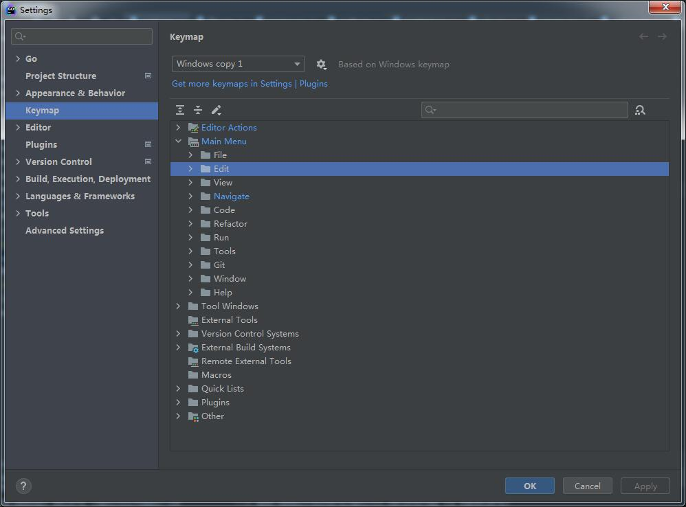

# GoLand常用快捷键

## 前言

可以通过FIle->Settings->Keymap->Main Menu对常用的快捷键做自定义设置。

也可以通过File-> Manage IDE Settings -> Export Settings / Import Settings对设置做导入导出。

下面列出平时开发中必备的快捷键，可以显著提升开发效率。

## 代码导航快捷键

* 跳转到对应文件

  * Shift + Alt + O：这是本人自定义的。

    可以在File->Settings->Keymap->Main Menu->Navigate->Search Everything里设置自定义快捷键。

* 搜索文件里面的内容

  * Ctrl + Shift + F

* 后退和前进

  Ctrl + Alt + 向左箭头

  Ctrl + Alt + 向右箭头

* 查看定义

  Ctrl + B

* 查看被使用情况

  Alt + F7

  或者使用Ctrl + Shift + F 搜索

  

## 调试快捷键

* 设置断点和取消断点

  Ctrl+F8：设置断点和取消断点

* 断点执行

  F9：跳到下一个断点

* 单步执行

  F8：结束当前步骤，执行下一步。如果当前步骤调用了函数，不会进入函数里，可以使用F7进入到函数里面

* 跳到函数里面和跳出函数

  F7：进入调用的函数里面

  Shift+F8：跳出调用的函数

* 查看当前所有断点，并且可以设置断点执行的条件

  Ctrl+Shift+F8
  
* 启动Debug调试模式

  Shift + F9

* 结束调试

  Ctrl + F2

* 启动普通Run模式

  Shift + F10

