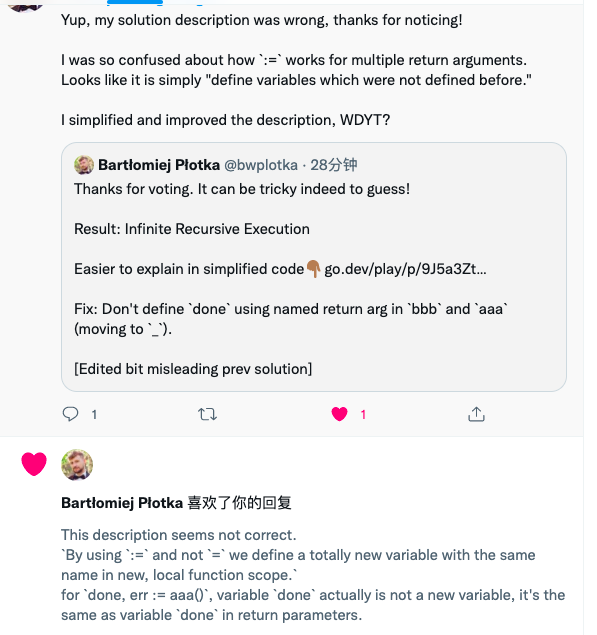

# Go Quiz: 从Go面试题看函数命名返回值的注意事项

## 题目

Redhat的首席工程师、Prometheus开源项目Maintainer [Bartłomiej Płotka](https://twitter.com/bwplotka) 在Twitter上出了一道Go编程题，结果超过80%的人都回答错了。

题目如下所示，回答下面这段程序的输出结果。

```go
// named_return.go
package main

import "fmt"

func aaa() (done func(), err error) {
	return func() { print("aaa: done") }, nil
}

func bbb() (done func(), _ error) {
	done, err := aaa()
	return func() { print("bbb: surprise!"); done() }, err
}

func main() {
	done, _ := bbb()
	done()
}
```

* A: `bbb: surprise!`
* B: `bbb: surprise!aaa: done`
* C: 编译报错
* D: 递归栈溢出

大家可以先思考下这段代码的输出结果是什么。


## 解析

在函数`bbb`最后执行return语句，会对返回值变量`done`进行赋值，

```go
done := func() { print("bbb: surprise!"); done() }
```

**注意**：闭包`func() { print("bbb: surprise!"); done() }`里的`done`并不会被替换成`done, err := aaa()`里的`done`的值。

因此函数`bbb`执行完之后，返回值之一的`done`实际上成为了一个递归函数，先是打印`"bbb: surprise!"`，然后再调用自己，这样就会陷入无限递归，直到栈溢出。因此本题的答案是`D`。

那为什么函数`bbb`最后return的闭包`func() { print("bbb: surprise!"); done() }`里的`done`并不会被替换成`done, err := aaa()`里的`done`的值呢？如果替换了，那本题的答案就是`B`了。


这个时候就要搬出一句老话了：

> This is a feature, not a bug


我们可以看下面这个更为简单的例子，来帮助我们理解：

```go
// named_return1.go
package main

import "fmt"

func test() (done func()) {
	return func() { fmt.Println("test"); done() }
}

func main() {
	done := test()
	// 下面的函数调用会进入死循环，不断打印test
	done()
}
```

正如上面代码里的注释说明，这段程序同样会进入无限递归直到栈溢出。

如果函数`test`最后return的闭包`func() { fmt.Println("test"); done() }`里的`done`是被提前解析了的话，因为`done`是一个函数类型的变量，`done`的零值是`nil`，那闭包里的`done`的值就会是`nil`，执行`nil`函数是会引发panic的。

**但实际上Go设计是允许上面的代码正常执行的(通过这种方式可以返回一个递归函数)**，因此函数`test`最后return的闭包里的`done`的值并不会提前解析，`test`函数执行完之后，实际上产生了下面的效果，返回的是一个递归函数，和本文开始的题目一样。

```go
done := func() { fmt.Println("test"); done() }
```

因此也会进入无限递归，直到栈溢出。


##  总结

这个题目其实很tricky，在实际编程中，要避免对命名返回值采用这种写法，非常容易出错。

想了解国外Go开发者对这个题目的讨论详情可以参考[Go Named Return Parameters Discussion](https://twitter.com/bwplotka/status/1494362886738780165)。

另外题目作者也给了如下所示的解释，原文地址可以参考[详细解释](https://go.dev/play/p/ELPEi2AK0DP)：

```go
package main

func aaa() (done func(), err error) {
	return func() { print("aaa: done") }, nil
}

func bbb() (done func(), _ error) {
	// NOTE(bwplotka): Here is the problem. We already defined special "return argument" variable called "done".
	// By using `:=` and not `=` we define a totally new variable with the same name in
	// new, local function scope.
	done, err := aaa()

	// NOTE(bwplotka): In this closure (anonymous function), we might think we use `done` from the local scope,
	// but we don't! This is because Go "return" as a side effect ASSIGNS returned values to
	// our special "return arguments". If they are named, this means that after return we can refer
	// to those values with those names during any execution after the main body of function finishes
	// (e.g in defer or closures we created).
	//
	// What is happening here is that no matter what we do in the local "done" variable, the special "return named"
	// variable `done` will get assigned with whatever was returned. Which in bbb case is this closure with
	// "bbb:surprise" print. This means that anyone who runs this closure AFTER `return` did the assignment
	// will start infinite recursive execution.
	//
	// Note that it's a feature, not a bug. We use this often to capture
	// errors (e.g https://github.com/efficientgo/tools/blob/main/core/pkg/errcapture/doc.go)
	//
	// Go compiler actually detects that `done` variable defined above is NOT USED. But we also have `err`
	// variable which is actually used. This makes compiler to satisfy that unused variable check,
	// which is wrong in this context..
	return func() { print("bbb: surprise!"); done() }, err
}

func main() {
	done, _ := bbb()
	done()
}
```

不过这个解释是有瑕疵的，主要是这句描述：

> By using `:=` and not `=` we define a totally new variable with the same name in
>  new, local function scope.

对于`done, err := aaa()`，返回变量`done`并不是一个新的变量，而是和函数`bbb`的返回变量`done`是同一个变量。

这里有一个小插曲：**本人把这个瑕疵反馈给了原作者，原作者同意了我的意见，删除了这块解释**。

 

最新版的英文解释如下，原文地址可以参考[修正版解释](https://go.dev/play/p/9J5a3ZtIPnL)。

```go
package main

func aaa() (done func()) {
	return func() { print("aaa: done") }
}

func bbb() (done func()) {
	done = aaa()

	// NOTE(bwplotka): In this closure (anonymous function), we might think we use `done` value assigned to aaa(),
	// but we don't! This is because Go "return" as a side effect ASSIGNS returned values to
	// our special "return arguments". If they are named, this means that after return we can refer
	// to those values with those names during any execution after the main body of function finishes
	// (e.g in defer or closures we created).
	//
	// What is happening here is that no matter what we do with our "done" variable, the special "return named"
	// variable `done` will get assigned with whatever was returned when the function ends.
	// Which in bbb case is this closure with "bbb:surprise" print. This means that anyone who runs
	// this closure AFTER `return` did the assignment, will start infinite recursive execution.
	//
	// Note that it's a feature, not a bug. We use this often to capture
	// errors (e.g https://github.com/efficientgo/tools/blob/main/core/pkg/errcapture/doc.go)
	return func() { print("bbb: surprise!"); done() }
}

func main() {
	done := bbb()
	done()
}
```


## 思考题

下面这段代码同样使用了命名返回值，大家可以看看这个道题的输出结果是什么。可以给微信公众号发送消息`nrv`获取答案。

```go
package main

func bar() (r int) {
	defer func() {
		r += 4
		if recover() != nil {
			r += 8
		}
	}()
	
	var f func()
	defer f()
	f = func() {
		r += 2
	}

	return 1
}

func main() {
	println(bar())
}
```


## 开源地址

文章和示例代码开源在GitHub: [Go语言初级、中级和高级教程](https://github.com/jincheng9/go-tutorial)。

公众号：coding进阶。关注公众号可以获取最新Go面试题和技术栈。

个人网站：[Jincheng's Blog](https://jincheng9.github.io/)。

知乎：[无忌](https://www.zhihu.com/people/thucuhkwuji)。


## References

* https://twitter.com/bwplotka/status/1494362886738780165
* https://go.dev/play/p/ELPEi2AK0DP
* https://go.dev/play/p/9J5a3ZtIPnL