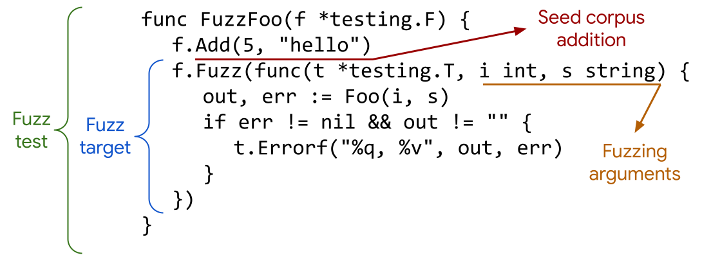

# 官方教程：Go fuzzing模糊测试

## 前言

Go 1.18在go工具链里引入了fuzzing模糊测试，可以帮助我们发现Go代码里的漏洞或者可能导致程序崩溃的输入。Go官方团队也在官网发布了fuzzing入门教程，帮助大家快速上手。



本人对Go官方教程在翻译的基础上做了一些表述上的优化，以飨读者。

**注意**：fuzzing模糊测试和Go已有的单元测试以及性能测试框架是互为补充的，并不是替代关系。


## 教程内容

这篇教程会介绍Go fuzzing的基础知识。fuzzing可以构造随机数据来找出代码里的漏洞或者可能导致程序崩溃的输入。通过fuzzing可以找出的漏洞包括SQL注入、缓冲区溢出、拒绝服务(Denial of Service)攻击和XSS(cross-site scripting)攻击等。

在这个教程里，你会给一个函数写一段fuzz test(模糊测试)程序，然后运行go命令来发现代码里的问题，最后通过调试来修复问题。

本文里涉及的专业术语，可以参考 [Go Fuzzing glossary](https://go.dev/doc/fuzz/#glossary)。

接下来会按照如下章节介绍：

1. [为你的代码创建一个目录](#为你的代码创建一个目录)
2. [实现一个函数](#实现一个函数)
3. [增加单元测试](#增加单元测试)
4. [增加模糊测试](#增加模糊测试)
5. [修复2个bug](#修复2个bug)
6. [总结](#总结)

## 准备工作

* 安装Go 1.18 Beta 1或者更新的版本。安装指引可以参考[下面的介绍](#安装和使用beta版本)。
* 有一个代码编辑工具。任何文本编辑器都可以。
* 有一个命令行终端。Go可以运行在Linux，Mac上的任何命令行终端，也可以运行在Windows的PowerShell或者cmd之上。
* 有一个支持fuzzing的环境。目前Go fuzzing只支持AMD64和ARM64架构。

### 安装和使用beta版本

这个教程需要使用Go 1.18 Beta 1或以上版本的泛型功能。使用如下步骤，安装beta版本 

1. 使用下面的命令安装beta版本

   ```sh
   $ go install golang.org/dl/go1.18beta1@latest
   ```

2. 运行如下命令来下载更新

   ```sh
   $ go1.18beta1 download
   ```

   **注意**：如果在MAC或者Linux上执行`go1.18beta1`提示`command not found`，需要设置`bash`或者`zsh`对应的profile环境变量文件。`bash`设置在`~/.bash_profile`文件里，内容为：

   ```bash
   export GOROOT=/usr/local/opt/go/libexec
   export GOPATH=$HOME/go
   export PATH=$PATH:$GOROOT/bin:$GOPATH/bin
   ```

   `GOROOT`和`GOPATH`的值可以通过`go env`命令查看，设置完后执行`source ~/.bash_profile`让设置生效，再执行`go1.18beta1`就不报错了。

3. 使用beta版本的go命令，不要去使用release版本的go命令

   你可以通过直接使用`go1.18beta1`命令或者给`go1.18beta1`起一个简单的别名

   * 直接使用`go1.18beta1`命令

     ```sh
     $ go1.18beta1 version
     ```

   * 给`go1.18beta1`命令起一个别名

     ```sh
     $ alias go=go1.18beta1
     $ go version
     ```

   下面的教程都假设你已经把`go1.18beta1`命令设置了别名`go`。


##   为你的代码创建一个目录

首先创建一个目录用于存放你写的代码。

1. 打开一个命令行终端，切换到你的`home`目录

   * 在Linux或者Mac上执行如下命令(Linux或者Mac上只需要执行`cd`就可以进入到`home`目录)

     ```bash
     cd
     ```

   * 在Windows上执行如下命令

     ```powershell
     C:\> cd %HOMEPATH%
     ```

2. 在命令行终端，创建一个名为`fuzz`的目录，并进入该目录

   ```bash
   $ mkdir fuzz
   $ cd fuzz
   ```

3. 创建一个go module

   运行`go mod init`命令，来给你的项目设置module路径

   ```bash
   $ go mod init example/fuzz
   ```

   **注意**：对于生产代码，你可以根据项目实际情况来指定module路径，如果想了解更多，可以参考[Go Module依赖管理](https://go.dev/doc/modules/managing-dependencies)。

接下来，我们来使用map写一些简单的代码来做字符串的反转，然后使用fuzzing来做模糊测试。

## 实现一个函数

在这个章节，你需要实现一个函数来对字符串做反转。

### 编写代码

1. 打开你的文本编辑器，在fuzz目录下创建`main.go`源文件。

2. 在`main.go`里编写如下代码：

   ```go
   // maing.go
   package main
   
   import "fmt"
   
   func Reverse(s string) string {
   	b := []byte(s)
   	for i, j := 0, len(b)-1; i < len(b)/2; i, j = i+1, j-1 {
   		b[i], b[j] = b[j], b[i]
   	}
   	return string(b)
   }
   
   func main() {
   	input := "The quick brown fox jumped over the lazy dog"
   	rev := Reverse(input)
   	doubleRev := Reverse(rev)
   	fmt.Printf("original: %q\n", input)
   	fmt.Printf("reversed: %q\n", rev)
   	fmt.Printf("reversed again: %q\n", doubleRev)
   }
   ```

### 运行代码

在`main.go`所在目录执行命令`go run .`来运行代码，结果如下：

```bash
$ go run .
original: "The quick brown fox jumped over the lazy dog"
reversed: "god yzal eht revo depmuj xof nworb kciuq ehT"
reversed again: "The quick brown fox jumped over the lazy dog"
```

## 增加单元测试

在这个章节，你会给`Reverse`函数编写单元测试代码。

### 编写单元测试

1. 在fuzz目录下创建文件`reverse_test.go`。

2. 在`reverse_test.go`里编写如下代码：

   ```go
   package main
   
   import (
       "testing"
   )
   
   func TestReverse(t *testing.T) {
       testcases := []struct {
           in, want string
       }{
           {"Hello, world", "dlrow ,olleH"},
           {" ", " "},
           {"!12345", "54321!"},
       }
       for _, tc := range testcases {
           rev := Reverse(tc.in)
           if rev != tc.want {
                   t.Errorf("Reverse: %q, want %q", rev, tc.want)
           }
       }
   }
   ```

### 运行单元测试

使用`go test`命令来运行单元测试

```bash
$ go test
PASS
ok      example/fuzz  0.013s
```

接下来，我们给`Reverse`函数增加模糊测试(fuzz test)代码。

## 增加模糊测试

单元测试有局限性，每个测试输入必须由开发者指定，显式加到单元测试的测试用例里。

fuzzing的优点之一是可以基于开发者代码里指定的测试输入作为基础数据，进一步自动生成新的随机测试数据，用来发现指定测试输入没有覆盖到的边界情况。

在这个章节，我们会把单元测试转换成模糊测试，这样可以更轻松地生成更多的测试输入。

**注意**：你可以把单元测试、性能测试和模糊测试放在同一个`*_test.go`文件里。

### 编写模糊测试

在文本编辑器里把`reverse_test.go`里的单元测试代码`TestReverse`替换成如下的模糊测试代码`FuzzReverse`。

```go
func FuzzReverse(f *testing.F) {
    testcases := []string{"Hello, world", " ", "!12345"}
    for _, tc := range testcases {
        f.Add(tc)  // Use f.Add to provide a seed corpus
    }
    f.Fuzz(func(t *testing.T, orig string) {
        rev := Reverse(orig)
        doubleRev := Reverse(rev)
        if orig != doubleRev {
            t.Errorf("Before: %q, after: %q", orig, doubleRev)
        }
        if utf8.ValidString(orig) && !utf8.ValidString(rev) {
            t.Errorf("Reverse produced invalid UTF-8 string %q", rev)
        }
    })
}
```

Fuzzing也有一定的局限性。

在单元测试里，因为测试输入是固定的，你可以知道调用`Reverse`函数后每个输入字符串得到的反转字符串应该是什么，然后在单元测试的代码里判断`Reverse`的执行结果是否和预期相符。例如，对于测试用例`Reverse("Hello, world")`，单元测试预期的结果是 `"dlrow ,olleH"`。

但是使用fuzzing时，我们没办法预期输出结果是什么，因为测试的输入除了我们代码里指定的用例之外，还有fuzzing随机生成的。对于随机生成的测试输入，我们当然没办法提前知道输出结果是什么。

虽然如此，本文里的`Reverse`函数有几个特性我们还是可以在模糊测试里做验证。

1. 对一个字符串做2次反转，得到的结果和源字符串相同
2. 反转后的字符串也仍然是一个有效的UTF-8编码的字符串

**注意**：fuzzing模糊测试和Go已有的单元测试以及性能测试框架是互为补充的，并不是替代关系。

比如我们实现的`Reverse`函数如果是一个错误的版本，直接return返回输入的字符串，是完全可以通过上面的模糊测试的，但是没法通过我们前面编写的单元测试。因此单元测试和模糊测试是互为补充的，不是替代关系。

Go模糊测试和单元测试在语法上有如下差异：

- Go模糊测试函数以FuzzXxx开头，单元测试函数以TestXxx开头

- Go模糊测试函数以 `*testing.F`作为入参，单元测试函数以`*testing.T`作为入参

- Go模糊测试会调用`f.Add`函数和`f.Fuzz`函数。

  - `f.Add`函数把指定输入作为模糊测试的种子语料库(seed corpus)，fuzzing基于种子语料库生成随机输入。
  - `f.Fuzz`函数接收一个fuzz target函数作为入参。fuzz target函数有多个参数，第一个参数是`*testing.T`，其它参数是被模糊的类型(**注意**：被模糊的类型目前只支持部分内置类型, 列在 [Go Fuzzing docs](https://go.dev/doc/fuzz/#requirements)，未来会支持更多的内置类型)。

  

上面的`FuzzReverse`函数里用到了`utf8`这个package，因此要在`reverse_test.go`开头import这个package，参考如下代码：

```go
package main

import (
    "testing"
    "unicode/utf8"
)
```

### 运行模糊测试

1. 执行如下命令来运行模糊测试。

   **这个方式只会使用种子语料库，而不会生成随机测试数据**。通过这种方式可以用来验证种子语料库的测试数据是否可以测试通过。(fuzz test without fuzzing)

   ```bash
   $ go test
   PASS
   ok      example/fuzz  0.013s
   ```

   如果`reverse_test.go`文件里有其它单元测试函数或者模糊测试函数，但是只想运行`FuzzReverse`模糊测试函数，我们可以执行`go test -run=FuzzReverse`命令。

   **注意**：`go test`默认会执行所有以`TestXxx`开头的单元测试函数和以`FuzzXxx`开头的模糊测试函数，默认不运行以`BenchmarkXxx`开头的性能测试函数，如果我们想运行 benchmark用例，则需要加上 `-bench` 参数。

2. 如果要基于种子语料库生成随机测试数据用于模糊测试，需要给`go test`命令增加` -fuzz`参数。(fuzz test with fuzzing)

   ```bash
   $ go test -fuzz=Fuzz
   fuzz: elapsed: 0s, gathering baseline coverage: 0/3 completed
   fuzz: elapsed: 0s, gathering baseline coverage: 3/3 completed, now fuzzing with 8 workers
   fuzz: minimizing 38-byte failing input file...
   --- FAIL: FuzzReverse (0.01s)
       --- FAIL: FuzzReverse (0.00s)
           reverse_test.go:20: Reverse produced invalid UTF-8 string "\x9c\xdd"
   
       Failing input written to testdata/fuzz/FuzzReverse/af69258a12129d6cbba438df5d5f25ba0ec050461c116f777e77ea7c9a0d217a
       To re-run:
       go test -run=FuzzReverse/af69258a12129d6cbba438df5d5f25ba0ec050461c116f777e77ea7c9a0d217a
   FAIL
   exit status 1
   FAIL    example/fuzz  0.030s
   ```

   上面的fuzzing测试结果是`FAIL`，引起`FAIL`的输入数据被写到了一个语料库文件里。下次运行`go test`命令的时候，即使没有`-fuzz`参数，这个语料库文件里的测试数据也会被用到。

   可以用文本编辑器打开`testdata/fuzz/FuzzReverse`目录下的文件，看看引起Fuzzing测试失败的测试数据长什么样。下面是一个示例文件，你那边运行后得到的测试数据可能和这个不一样，但文件里的内容格式会是一样的。

   ```markdown
   go test fuzz v1
   string("泃")
   ```

   语料库文件里的第1行标识的是编码版本(encoding version，说直白点，就是这个种子语料库文件里内容格式的版本)，虽然目前只有v1这1个版本，但是Fuzzing设计者考虑到未来可能引入新的编码版本，于是加了编码版本的概念。

   从第2行开始，每一行数据对应的是语料库的每条测试数据(corpus entry)的其中一个参数，按照参数先后顺序排列。

   ```go
   f.Fuzz(func(t *testing.T, orig string) {
   		rev := Reverse(orig)
   		doubleRev := Reverse(rev)
   		if orig != doubleRev {
   			t.Errorf("Before: %q, after: %q", orig, doubleRev)
   		}
   		if utf8.ValidString(orig) && !utf8.ValidString(rev) {
   			t.Errorf("Reverse produced invalid UTF-8 string %q %q", orig, rev)
   		}
   })
   ```

   本文的`FuzzReverse`里的fuzz target函数`func(t *testing.T, orig string)`只有`orig`这1个参数作为真正的测试输入，也就是每条测试数据其实就1个输入，因此在上面示例的`testdata/fuzz/FuzzReverse`目录下的文件里只有`string("泃")`这一行。

   如果每条测试数据有N个参数，那fuzzing找出的导致fuzz test失败的每条测试数据在`testdata`目录下的文件里会有N行，第`i`行对应第`i`个参数。

3. 再次运行`go test`命令，这次不带`-fuzz`参数。

   我们会发现虽然没有`-fuzz`参数，但是模糊测试的时候仍然用到了上面第2步找到的测试数据。

   ```bash
   $ go test
   --- FAIL: FuzzReverse (0.00s)
       --- FAIL: FuzzReverse/af69258a12129d6cbba438df5d5f25ba0ec050461c116f777e77ea7c9a0d217a (0.00s)
           reverse_test.go:20: Reverse produced invalid string
   FAIL
   exit status 1
   FAIL    example/fuzz  0.016s
   ```

   既然Go fuzzing测试没通过，那就需要我们调试代码来找出问题所在了。

## 修复2个bug

在这个章节，我们会调试程序，修复Go fuzzing测出来的bug。

你可以自己花一些时间思考下，先尝试自己解决问题。

### 定位问题

你可以使用不同的方法来调试上面发现的bug。

如果你使用的是VS Code，那可以在VS Code里设置你的[Debug调试器](https://github.com/golang/vscode-go/blob/master/docs/debugging.md)来加断点进行调试。

本文里，我们会使用打印日志的方式进行调试。

运行模糊测试时的报错信息为：`reverse_test.go:20: Reverse produced invalid UTF-8 string "\x9c\xdd"`

基于这个报错，我们来看看文档里对于 [`utf8.ValidString`](https://pkg.go.dev/unicode/utf8)的描述。

```markdown
ValidString reports whether s consists entirely of valid UTF-8-encoded runes.
```

我们实现的`Reverse`函数是按照字节(byte)为维度进行字符串反转，这就是问题所在。

比如中文里的字符 `泃`其实是由3个字节组成的，如果按照字节反转，反转后得到的就是一个无效的字符串了。

因此为了保证字符串反转后得到的仍然是一个有效的UTF-8编码的字符串，我们要按照`rune`进行字符串反转。

为了更好地方便大家理解中文里的字符 `泃`按照`rune`为维度有多少个`rune`，以及按照byte反转后得到的结果长什么样，我们对代码做一些修改。

#### 编写代码

按照如下方式修改`FuzzReverse`里的代码。

```go
f.Fuzz(func(t *testing.T, orig string) {
    rev := Reverse(orig)
    doubleRev := Reverse(rev)
    t.Logf("Number of runes: orig=%d, rev=%d, doubleRev=%d", utf8.RuneCountInString(orig), utf8.RuneCountInString(rev), utf8.RuneCountInString(doubleRev))
    if orig != doubleRev {
        t.Errorf("Before: %q, after: %q", orig, doubleRev)
    }
    if utf8.ValidString(orig) && !utf8.ValidString(rev) {
        t.Errorf("Reverse produced invalid UTF-8 string %q", rev)
    }
})
```

#### 运行代码

```bash
$ go test
--- FAIL: FuzzReverse (0.00s)
    --- FAIL: FuzzReverse/28f36ef487f23e6c7a81ebdaa9feffe2f2b02b4cddaa6252e87f69863046a5e0 (0.00s)
        reverse_test.go:16: Number of runes: orig=1, rev=3, doubleRev=1
        reverse_test.go:21: Reverse produced invalid UTF-8 string "\x83\xb3\xe6"
FAIL
exit status 1
FAIL    example/fuzz    0.598s
```

我们的种子语料库里每个符号都是单个字节。但是像 `泃`这样的中文符号由多个字节组成，如果以字节为维度进行反转，就会得到无效的结果。

**注意**：如果你对于Go如何处理字符串感兴趣，可以阅读官方博客里的这篇文章 [Strings, bytes, runes and characters in Go](https://go.dev/blog/strings) 来加深理解。

既然我们明确了问题，那我们就可以修复这个bug了。

### 修复问题

以`rune`为维度进行字符串反转。

#### 编写代码

修改`Reverse`函数的实现如下：

```go
func Reverse(s string) string {
    r := []rune(s)
    for i, j := 0, len(r)-1; i < len(r)/2; i, j = i+1, j-1 {
        r[i], r[j] = r[j], r[i]
    }
    return string(r)
}
```

#### 运行代码

1. 运行命令：`go test`

   ```bash
   $ go test
   PASS
   ok      example/fuzz  0.016s
   ```

   测试通过啦!(别高兴太早，这个只是通过了种子语料库的测试)

2. 再次运行 `go test -fuzz`，看看我们是否会发现新的bug

   ```bash
   $ go test -fuzz=Fuzz
   fuzz: elapsed: 0s, gathering baseline coverage: 0/37 completed
   fuzz: minimizing 506-byte failing input file...
   fuzz: elapsed: 0s, gathering baseline coverage: 5/37 completed
   --- FAIL: FuzzReverse (0.02s)
       --- FAIL: FuzzReverse (0.00s)
           reverse_test.go:33: Before: "\x91", after: "�"
   
       Failing input written to testdata/fuzz/FuzzReverse/1ffc28f7538e29d79fce69fef20ce5ea72648529a9ca10bea392bcff28cd015c
       To re-run:
       go test -run=FuzzReverse/1ffc28f7538e29d79fce69fef20ce5ea72648529a9ca10bea392bcff28cd015c
   FAIL
   exit status 1
   FAIL    example/fuzz  0.032s
   ```

   通过上面的报错，我们发现对一个字符串做了2次反转后得到的和原字符串不一样。

   这次测试输入本身是非法的unicode，但是为什么会2次反转后得到的字符串还不一样呢？

   我们继续调试。

## 修复2次字符串反转的bug

### 定位问题

对于这个问题，加断点调试会很好定位。为了方便讲解，本文使用加日志的方式进行调试。

我们可以仔细观察原字符串第一次反转后得到的结果来定位问题。

#### 编写代码

1. 修改 `Reverse` 函数。

   ```go
   func Reverse(s string) string {
       fmt.Printf("input: %q\n", s)
       r := []rune(s)
       fmt.Printf("runes: %q\n", r)
       for i, j := 0, len(r)-1; i < len(r)/2; i, j = i+1, j-1 {
           r[i], r[j] = r[j], r[i]
       }
       return string(r)
   }
   ```

   这可以帮助我们理解把原字符串转成`rune`切片后发生了什么。

#### 运行代码

这一次，我们只运行让fuzz test失败的测试数据，使用 `go test -run`命令。

运行FuzzXxx/testdata目录下指定的语料库测试数据，可以给`-run`参数指定值 {FuzzTestName}/{filename} ，这可以让我们聚焦在让fuzz test失败的测试数据上。

```bash
$ go test -run=FuzzReverse/28f36ef487f23e6c7a81ebdaa9feffe2f2b02b4cddaa6252e87f69863046a5e0
input: "\x91"
runes: ['�']
input: "�"
runes: ['�']
--- FAIL: FuzzReverse (0.00s)
    --- FAIL: FuzzReverse/28f36ef487f23e6c7a81ebdaa9feffe2f2b02b4cddaa6252e87f69863046a5e0 (0.00s)
        reverse_test.go:16: Number of runes: orig=1, rev=1, doubleRev=1
        reverse_test.go:18: Before: "\x91", after: "�"
FAIL
exit status 1
FAIL    example/fuzz    0.145s
```

首先我们要了解：在Go语言里，字符串是只读的字节切片(In Go, a string is a read only slice of bytes)，字节切片里的每个字节不一定都是有效的UTF-8编码的字节，详情可以参考[a string is a read only slice of bytes](https://go.dev/blog/strings)。

上面的例子里，输入的字符串是只有1个byte的字节切片，这1个byte是`\x91`。

当我们把这个输入的字符串转成`[]rune`时，Go会把字节切片编码为UTF-8，于是就把`\x91`替换成了'�'，'�'反转后还是'�'，因此就导致原字符串`\x91`反转后得到的字符串是'�'了。

现在原因明确了，是因为输入的数据是非法的unicode。那接下来我们就可以修正`Reverse`函数的实现了。

### 修复问题

修复方式为：在`Reverse`里检查输入是否为合法的UTF-8编码字符串，如果非法，就返回error。

#### 编写代码

1. 修改`Reverse` 实现如下：

   ```go
   func Reverse(s string) (string, error) {
       if !utf8.ValidString(s) {
           return s, errors.New("input is not valid UTF-8")
       }
       r := []rune(s)
       for i, j := 0, len(r)-1; i < len(r)/2; i, j = i+1, j-1 {
           r[i], r[j] = r[j], r[i]
       }
       return string(r), nil
   }
   ```

2. 由于`Reverse`函数现在会返回error，因此要修改`main.go`里的对应代码，修改如下：

   ```go
   func main() {
       input := "The quick brown fox jumped over the lazy dog"
       rev, revErr := Reverse(input)
       doubleRev, doubleRevErr := Reverse(rev)
       fmt.Printf("original: %q\n", input)
       fmt.Printf("reversed: %q, err: %v\n", rev, revErr)
       fmt.Printf("reversed again: %q, err: %v\n", doubleRev, doubleRevErr)
   }
   ```

   因为`main`函数里都是有效的UTF-8编码字符串，所以对`Reverse`的调用会返回一个值为nil的error。

3. 由于`Reverse`函数用到了`errors`和`utf8`这2个package，因此在`main.go`的开头要import这2个package。

   ```go
   import (
       "errors"
       "fmt"
       "unicode/utf8"
   )
   ```

4. 同样，我们需要修改`reverse_test.go`文件，对于非法的字符串输入，可以直接跳过测试。

   ```go
   func FuzzReverse(f *testing.F) {
       testcases := []string {"Hello, world", " ", "!12345"}
       for _, tc := range testcases {
           f.Add(tc)  // Use f.Add to provide a seed corpus
       }
       f.Fuzz(func(t *testing.T, orig string) {
           rev, err1 := Reverse(orig)
           if err1 != nil {
               return
           }
           doubleRev, err2 := Reverse(rev)
           if err2 != nil {
                return
           }
           if orig != doubleRev {
               t.Errorf("Before: %q, after: %q", orig, doubleRev)
           }
           if utf8.ValidString(orig) && !utf8.ValidString(rev) {
               t.Errorf("Reverse produced invalid UTF-8 string %q", rev)
           }
       })
   }
   ```

   除了使用return，你还可以调用 `t.Skip()` 来跳过当前的测试输入，继续下一轮测试输入。

#### 运行代码

1. 运行测试代码

   ```
   $ go test
   PASS
   ok      example/fuzz  0.019s
   ```

2. 运行模糊测试 `go test -fuzz=Fuzz`，执行几秒后，使用 `ctrl-C` 结束测试。

   ```
   $ go test -fuzz=Fuzz
   fuzz: elapsed: 0s, gathering baseline coverage: 0/38 completed
   fuzz: elapsed: 0s, gathering baseline coverage: 38/38 completed, now fuzzing with 4 workers
   fuzz: elapsed: 3s, execs: 86342 (28778/sec), new interesting: 2 (total: 35)
   fuzz: elapsed: 6s, execs: 193490 (35714/sec), new interesting: 4 (total: 37)
   fuzz: elapsed: 9s, execs: 304390 (36961/sec), new interesting: 4 (total: 37)
   ...
   fuzz: elapsed: 3m45s, execs: 7246222 (32357/sec), new interesting: 8 (total: 41)
   ^Cfuzz: elapsed: 3m48s, execs: 7335316 (31648/sec), new interesting: 8 (total: 41)
   PASS
   ok      example/fuzz  228.000s
   ```

   fuzz test如果没有遇到错误，默认会一直运行下去，需要使用 `ctrl-C` 结束测试。

   也可以传递`-fuzztime`参数来指定测试时间，这样就不用 `ctrl-C` 了。

3. 指定测试时间。 `go test -fuzz=Fuzz -fuzztime 30s` 如果没有遇到错误会执行30s后自动结束。

   ```
   $ go test -fuzz=Fuzz -fuzztime 30s
   fuzz: elapsed: 0s, gathering baseline coverage: 0/5 completed
   fuzz: elapsed: 0s, gathering baseline coverage: 5/5 completed, now fuzzing with 4 workers
   fuzz: elapsed: 3s, execs: 80290 (26763/sec), new interesting: 12 (total: 12)
   fuzz: elapsed: 6s, execs: 210803 (43501/sec), new interesting: 14 (total: 14)
   fuzz: elapsed: 9s, execs: 292882 (27360/sec), new interesting: 14 (total: 14)
   fuzz: elapsed: 12s, execs: 371872 (26329/sec), new interesting: 14 (total: 14)
   fuzz: elapsed: 15s, execs: 517169 (48433/sec), new interesting: 15 (total: 15)
   fuzz: elapsed: 18s, execs: 663276 (48699/sec), new interesting: 15 (total: 15)
   fuzz: elapsed: 21s, execs: 771698 (36143/sec), new interesting: 15 (total: 15)
   fuzz: elapsed: 24s, execs: 924768 (50990/sec), new interesting: 16 (total: 16)
   fuzz: elapsed: 27s, execs: 1082025 (52427/sec), new interesting: 17 (total: 17)
   fuzz: elapsed: 30s, execs: 1172817 (30281/sec), new interesting: 17 (total: 17)
   fuzz: elapsed: 31s, execs: 1172817 (0/sec), new interesting: 17 (total: 17)
   PASS
   ok      example/fuzz  31.025s
   ```

   Fuzzing测试通过！

   除了`-fuzz`参数外，有几个新的参数也被引入到了`go test`命令，具体可以参考 [documentation](https://go.dev/doc/fuzz/#custom-settings)。

## 总结

目前你已经学会了Go fuzzing的使用方法。

接下来，你可以在自己写过的代码里，尝试使用fuzzing来发现代码里的bug。

如果你真的发现了bug，请考虑把案例提交到了[trophy case](https://github.com/golang/go/wiki/Fuzzing-trophy-case)。

如果你发现了Go fuzzing的任何问题或者想提feature，可以在这里反馈[file an issue](https://github.com/golang/go/issues/new/?&labels=fuzz)。

查看文档 [go.dev/doc/fuzz](https://go.dev/doc/fuzz/#requirements)了解更多Go Fuzzing的知识。

本文的完整代码参考[Go Fuzzing示例代码](https://github.com/jincheng9/go-tutorial/tree/main/workspace/senior/p22/fuzz)。


## 开源地址

文章和示例代码开源在GitHub: [Go语言初级、中级和高级教程](https://github.com/jincheng9/go-tutorial)。

公众号：coding进阶。关注公众号可以获取最新Go面试题和技术栈。

个人网站：[Jincheng's Blog](https://jincheng9.github.io/)。

知乎：[无忌](https://www.zhihu.com/people/thucuhkwuji)。


## References

* Fuzzing教程：https://go.dev/doc/tutorial/fuzz
* Fuzzing提案：https://github.com/golang/go/issues/44551
* Fuzzing介绍：https://go.dev/doc/fuzz/