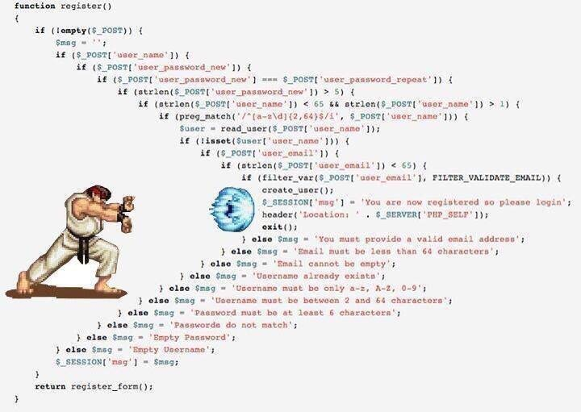

# Go常见错误第12篇：冗余的嵌套代码

## 前言

这是Go常见错误系列的第12篇：Go语言中冗余的嵌套代码，俗称箭头型代码。

 

素材来源于Go布道者，现Docker公司资深工程师[Teiva Harsanyi](https://teivah.github.io/)。

本文涉及的源代码全部开源在：[Go常见错误源代码](https://github.com/jincheng9/go-tutorial/tree/main/workspace/senior/p28)，欢迎大家关注公众号，及时获取本系列最新更新。

 

## 常见错误

我们先看看如下的代码：

```go
func join(s1, s2 string, max int) (string, error) {
    if s1 == "" {
        return "", errors.New("s1 is empty")
    } else {
        if s2 == "" {
            return "", errors.New("s2 is empty")
        } else {
            concat, err := concatenate(s1, s2)
            if err != nil {
                return "", err
            } else {
                if len(concat) > max {
                    return concat[:max], nil
                } else {
                    return concat, nil
                }
            }
        }
    }
}
 
func concatenate(s1 string, s2 string) (string, error) {
    // ...
}
```

这段代码要做的事情很简单：

* 把两个字符串s1和s2拼接起来，如果长度超过max，就只返回长度为max的子串。
* 实现过程中，对s1和s2做了判空；对concatenate返回值有无error做了判断；

从功能正确性的角度来说，代码完全没有毛病。但是看着很费劲，因为嵌套了很多层。

##  优化版本

我们对上面的多层嵌套代码优化如下：

```go
func join(s1, s2 string, max int) (string, error) {
    if s1 == "" {
        return "", errors.New("s1 is empty")
    }
    if s2 == "" {
        return "", errors.New("s2 is empty")
    }
    concat, err := concatenate(s1, s2)
    if err != nil {
        return "", err
    }
    if len(concat) > max {
        return concat[:max], nil
    }
    return concat, nil
}
 
func concatenate(s1 string, s2 string) (string, error) {
    // ...
}
```

这段代码实现了和刚才完全一样的功能，但是可读性好很多。

那有什么最佳实践我们可以作为参考，来规范代码实现呢？

## 最佳实践

通常来说，函数里的代码嵌套的层次越多，可读性就越差。可以参考如下原则来规范代码编写：

- 当if语句里会return时，那不要继续用else了，直接把else里的内容和if放在同一个层次。

  bad case:

  ```go
  if foo() {
      // ...
      return true
  } else {
      // ...
  }
  ```

  good case:

  ```go
  if foo() {
      // ...
      return true
  }
  // ...
  ```


- 如果修改判断条件，可以减少嵌套层次，可以考虑对判断条件做调整。示例如下：

  bad case:

  ```go
  if s != "" {
      // ...
  } else {
      return errors.New("empty string")
  }
  ```

  good case:

  ```go
  if s == "" {
      return errors.New("empty string")
  }
  // ...
  ```

* 归纳上面2个原则，其实就是能先return的就先return，减少不必要的代码嵌套。

  感兴趣的也可以看看参考资料里"左耳朵耗子"写过的一篇文章"如何重构箭头型代码"，

下一篇文章，我们会讲解下Go语言里init函数的常见错误和最佳实践。


## 推荐阅读

* [Go面试题系列，看看你会几题？](https://mp.weixin.qq.com/mp/appmsgalbum?__biz=Mzg2MTcwNjc1Mg==&action=getalbum&album_id=2199553588283179010#wechat_redirect)

* [Go常见错误第1篇：未知枚举值](https://mp.weixin.qq.com/s?__biz=Mzg2MTcwNjc1Mg==&mid=2247484146&idx=1&sn=10fb12b643a2e37c090e5aa3bc583152&chksm=ce124d9df965c48bb954aeddabdff3db12738ded3875542250c5d0ef6cfd4417fc56580288b1&token=1912894792&lang=zh_CN#rd)

* [Go常见错误第2篇：benchmark性能测试的坑](https://mp.weixin.qq.com/s?__biz=Mzg2MTcwNjc1Mg==&mid=2247484163&idx=1&sn=b28d61c1f3ec9d914e698dce105ba5d1&chksm=ce124c6cf965c57a90bc85a5295ed9375103de20607b509f845583ff6686385df0ed96653d00&token=1912894792&lang=zh_CN#rd)

* [Go常见错误第3篇：go指针的性能问题和内存逃逸](https://mp.weixin.qq.com/s?__biz=Mzg2MTcwNjc1Mg==&mid=2247484247&idx=1&sn=faf716627afb00df646cecff023fb63c&chksm=ce124c38f965c52efd009a4c98691d56b5765dc7dce98aa49b226ad9274bd062d8d01e702e91&token=1899277735&lang=zh_CN#rd)

* [Go常见错误第4篇：break操作的注意事项](https://mp.weixin.qq.com/s?__biz=Mzg2MTcwNjc1Mg==&mid=2247484262&idx=1&sn=c1bea8af60444a4ef73c4d4d7a09d16d&chksm=ce124c09f965c51f3663ac9089a792d36c3685850e12695dd26d15a1a50f393b2d7c92b9983a&token=461369035&lang=zh_CN#rd)

* [Go常见错误第5篇：Go语言Error管理](https://mp.weixin.qq.com/s?__biz=Mzg2MTcwNjc1Mg==&mid=2247484274&idx=1&sn=711abea3c6fd5d15341ee1b34da8a160&chksm=ce124c1df965c50b3af84965f7ed30b574cd0b247ea6f77b944ec858bd43ee37f4c1554a5bce&token=1846351524&lang=zh_CN#rd)

* [Go常见错误第6篇：slice初始化常犯的错误](https://mp.weixin.qq.com/s?__biz=Mzg2MTcwNjc1Mg==&mid=2247484289&idx=1&sn=2b8171458cde4425b28fdf8f51df8d7c&chksm=ce124ceef965c5f8a14f5951457ce2ac0ecc4612cf2013957f1d818b6e74da7c803b9df1d394&token=1477304797&lang=zh_CN#rd)

* [Go常见错误第7篇：不使用-race选项做并发竞争检测](https://mp.weixin.qq.com/s?__biz=Mzg2MTcwNjc1Mg==&mid=2247484299&idx=1&sn=583c3470a76e93b0af0d5fc04fe29b55&chksm=ce124ce4f965c5f20de5887b113eab91f7c2654a941491a789e4ac53c298fbadb4367acee9bb&token=1918756920&lang=zh_CN#rd)

* [Go常见错误第8篇：并发编程中Context使用常见错误](https://mp.weixin.qq.com/s?__biz=Mzg2MTcwNjc1Mg==&mid=2247484317&idx=1&sn=474dad373684979fc96ba59182f08cf5&chksm=ce124cf2f965c5e4a29e313b4654faacef03e78da7aaf2ba6912d7b490a1df851a1bcbfec1c9&token=1918756920&lang=zh_CN#rd)

* [Go常见错误第9篇：使用文件名称作为函数输入](https://mp.weixin.qq.com/s?__biz=Mzg2MTcwNjc1Mg==&mid=2247484325&idx=1&sn=689c1b3823697cc583e1e818c4c76ee5&chksm=ce124ccaf965c5dce4e497f6251c5f0a8473b8e2ae3824bd72fe8c532d6dd84e6375c3990b3e&token=1266762504&lang=zh_CN#rd)

* [Go常见错误第10篇：Goroutine和循环变量一起使用的坑](https://mp.weixin.qq.com/s?__biz=Mzg2MTcwNjc1Mg==&mid=2247484335&idx=1&sn=cc8c6ceae72b30ec6f4d4e7b4367baca&chksm=ce124cc0f965c5d60410f977cdf31f127694fd0d49c35e2061ce8fb5fb9387bfa321196db438&token=1656737387&lang=zh_CN#rd)

* [Go常见错误第11篇：意外的变量遮蔽(variable shadowing)](https://mp.weixin.qq.com/s?__biz=Mzg2MTcwNjc1Mg==&mid=2247484519&idx=1&sn=00f13bdb95bd8f7c4eb1582a4c981991&chksm=ce124b08f965c21e28ea3a1c67b3b501fe45ba1a2c4af5048cad3a2d5d8303b6fc0192235b6d&token=1762934632&lang=zh_CN#rd)

  

## 开源地址

文章和示例代码开源在GitHub: [Go语言初级、中级和高级教程](https://github.com/jincheng9/go-tutorial)。

公众号：coding进阶。关注公众号可以获取最新Go面试题和技术栈。

个人网站：[Jincheng's Blog](https://jincheng9.github.io/)。

知乎：[无忌](https://www.zhihu.com/people/thucuhkwuji)。


## 福利

我为大家整理了一份后端开发学习资料礼包，包含编程语言入门到进阶知识(Go、C++、Python)、后端开发技术栈、面试题等。

关注公众号「coding进阶」，发送消息 **backend** 领取资料礼包，这份资料会不定期更新，加入我觉得有价值的资料。

发送消息「**进群**」，和同行一起交流学习，答疑解惑。


## References

* https://livebook.manning.com/book/100-go-mistakes-how-to-avoid-them/chapter-2/
* https://coolshell.cn/articles/17757.html