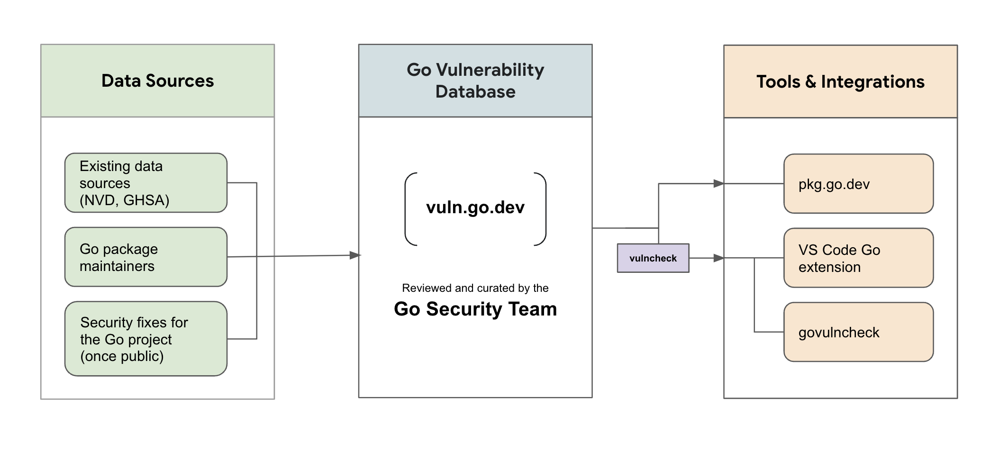

# Go的全新漏洞检测工具govulncheck来了

## 前言

Go安全团队在2022.09.06发布了全新的漏洞检测工具`govulncheck`，可以帮助我们发现Go程序里的安全漏洞。

本文详细介绍该工具目前的现状以及接下来的功能规划。

## Go漏洞检测系统架构



上图是Go安全团队对于Go代码漏洞检测的系统架构图。

* 第1步，漏洞采集。Go安全团队会采集众多漏洞数据库，包括公开的漏洞数据库(例如[National Vulnerability Database (NVD)](https://nvd.nist.gov/)和 [GitHub Advisory Database](https://github.com/advisories))、社区反馈的[Go package漏洞]((https://go.dev/s/vulndb-report-new))以及Go团队修复过的安全漏洞等。
* 第2步：更新Go的漏洞数据库。对于第1步里收集到的安全漏洞，Go安全团队会出具评估报告，对报告的漏洞做评审，如果确认是需要处理的会进入到Go的漏洞数据库里。这些漏洞信息按照 [Open Source Vulnerability (OSV) format](https://ossf.github.io/osv-schema/) 格式进行存储，并且可以通过[API](https://go.dev/security/vuln/database#api)获取到。
* 第3步：工具集成。对于新的漏洞处理后，会相应更新 [pkg.go.dev](https://pkg.go.dev/) 上的漏洞说明以及发布漏洞检测工具 [govulncheck](https://pkg.go.dev/golang.org/x/vuln/cmd/govulncheck)的新版本。`govulncheck`可以分析扫描你的代码仓库，只展示那些真正影响到你程序执行的漏洞。`govulncheck`工具非常可靠，很少误报，可以帮助你快速发现一些已知的安全漏洞。

## Go漏洞数据库

Go安全团队维护了一个漏洞数据库，地址是[https://vuln.go.dev](https://vuln.go.dev/)，也就是上面第2步所说的漏洞数据库。

* 如果你发现了新漏洞，可以通过这个[安全漏洞链接]((https://go.dev/s/vulndb-report-new))报告漏洞。
* 如果你认为已有的漏洞报告描述有问题，可以在这个[链接](https://go.dev/s/vulndb-report-feedback)进行反馈。

Go的漏洞数据库里包含的漏洞，可以在这个链接地址[pkg.go.dev/vuln](https://pkg.go.dev/vuln)进行查看。

## govulncheck

全新的[govulncheck](https://pkg.go.dev/golang.org/x/vuln/cmd/govulncheck) 命令可以帮助你发现代码里的安全漏洞。

安装和使用方法如下：

```
$ go install golang.org/x/vuln/cmd/govulncheck@latest
$ govulncheck ./...
```

`govulncheck`是一个独立的工具，可能会频繁更新和迭代。Go安全团队对于`govulncheck`的长期计划是把该工具集成到Go的发布版本里。

**备注**:

* `golang.org/x`下所有package的源码独立于Go源码的主干分支，也不在Go的二进制安装包里。如果需要使用`golang.org/x`下的package，可以使用`go get`来安装。`govulncheck`工具就属于这种情况。
* `golang.org/x/exp`下的所有package都属于实验性质或者被废弃的package，不建议使用。

[golang.org/x/vuln](https://pkg.go.dev/golang.org/x/vuln)这个仓库里包含有3个主要模块：

* [vulncheck](https://pkg.go.dev/golang.org/x/vuln/vulncheck) 包。为了方便把`govulncheck`的漏洞检测功能集成给其它工具或服务，[vulncheck](https://pkg.go.dev/golang.org/x/vuln/vulncheck) 里把`govulncheck`的功能进行了封装，在`vulncheck`这个package里提供了相应的Go函数，可以被直接调用。
* `govulncheck`命令。是命令行工具，对`vulncheck`包里漏洞检测功能做了封装。
* [client](golang.org/x/vuln/client)包。该package封装了一个用于和Go漏洞数据库交互的client。

## 集成

为了方便Go开发者更早和更好地了解到漏洞信息，Go团队把漏洞检测也集成到了Go的工具链和服务里。

例如，大家可以在`package.go.dev`网站的[版本漏洞](https://pkg.go.dev/golang.org/x/text?tab=versions)页面查看到`golang.org/text`这个package各个版本的安全漏洞情况。

Go的VS Code扩展插件对于`govulncheck`的支持也很快就可以发布。

## 总结

* 详细的`govulncheck`命令使用说明参考：[官方文档](https://pkg.go.dev/golang.org/x/vuln/cmd/govulncheck)。

* 目前`govulncheck`也有一些局限性，比如：

  * 扫描二进制文件的安全漏洞时，要求该二进制文件必须是使用Go 1.18或者更高版本编译的，不支持对低版本编译的二进制文件进行安全漏洞扫描。

  - 对于函数指针和接口(interface)调用的分析比较保守，在某些情况下可能导致误报漏洞。

  - `govulncheck`不能够展示Go二进制文件里扫描出来的安全漏洞的调用图(call graph)，这是因为Go二进制文件并不包含详细的调用链信息。对于二进制文件里的代码也可能发生误报。

  - 只会报告`govulncheck`当前执行的Go编译环境和配置(GOOS/GOARCH)下的漏洞。例如，
    - 假设一个漏洞如果只在Linux下才有，那在Windows下执行`govulncheck`的时候就不会报告该漏洞。对于跨平台开发的项目，比如Windows下开发，实际部署在Linux上，那就可能导致开发环境下不能检测出漏洞。
    - 假设Go 1.18标准库里才有的漏洞，如果当前执行`govulncheck`所在的编译环境的Go版本是1.19，那也不会报告该漏洞。

更多关于`govulncheck`的限制，可以参考[govulncheck limitations](https://pkg.go.dev/golang.org/x/vuln/cmd/govulncheck#hdr-Limitations)。

## 开源地址

文章和示例代码开源在GitHub: [Go语言初级、中级和高级教程](https://github.com/jincheng9/go-tutorial)。

公众号：coding进阶。关注公众号可以获取最新Go面试题和技术栈。

个人网站：[Jincheng's Blog](https://jincheng9.github.io/)。

知乎：[无忌](https://www.zhihu.com/people/thucuhkwuji)。

## 福利

我为大家整理了一份后端开发学习资料礼包，包含编程语言入门到进阶知识(Go、C++、Python)、后端开发技术栈、面试题等。

关注公众号「coding进阶」，发送消息 **backend** 领取资料礼包，这份资料会不定期更新，加入我觉得有价值的资料。还可以发送消息「**进群**」，和同行一起交流学习，答疑解惑。

## References

* https://go.dev/blog/vuln
* https://go.dev/security/vuln/
* https://go.dev/security/vuln/database
* https://pkg.go.dev/golang.org/x/vuln/cmd/govulncheck