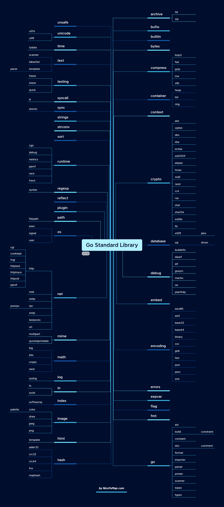

# Go 1.20要来了，看看都有哪些变化-第1篇

## 前言

Go官方团队在2022.12.08发布了Go 1.20 rc1(release candidate)版本，Go 1.20的正式release版本预计会在2023年2月份发布。

让我们先睹为快，看看Go 1.20给我们带来了哪些变化。(文末有彩蛋！)

安装方法：

```bash
$ go install golang.org/dl/go1.20rc1@latest
$ go1.20rc1 download
```

这是Go 1.20版本更新内容详解的第1篇，欢迎大家关注公众号，及时获取本系列最新更新。

## Go 1.20发布清单

和Go 1.19相比，改动内容适中，主要涉及语言(Language)、可移植性(Ports)、工具链(Go Tools)、运行时(Runtime)、编译器(Compiler)、汇编器(Assembler)、链接器(Linker)和核心库(Core library)等方面的优化。

我们逐个看看具体都有哪些变化。

### 语言变化

Go 1.20在语言层面带来了4个变化。

#### slice转数组

Go1.17在语言层面开始支持将slice转为指向数组的指针。

示例如下：

```go
s := make([]byte, 2, 4)
// 将s这个slice转为指向byte数组的指针s0
// 其中[0]byte里的0表示数组的长度，虽然长度为0，但值不等于nil
s0 := (*[0]byte)(s)      // s0 != nil
fmt.Printf("%T")
// 将s[1:]这个slice转为指向byte数组的指针s1
// s1指向的数组的长度为1
s1 := (*[1]byte)(s[1:])  // &s1[0] == &s[1]
// 将s这个slice转为指向byte数组的指针s2
// s2指向的数组的长度为2 
s2 := (*[2]byte)(s)      // &s2[0] == &s[0]
// 将s这个slice转为指向byte数组的指针s4
// s4指向的数组的长度为4 
s4 := (*[4]byte)(s)      // panics: len([4]byte) > len(s)
```

注意：slice转为指向数组的指针时，如果数组定义的长度超过了slice的长度，会抛panic。

所以上面`s4 := (*[4]byte)(s)`这行代码虽然可以编译通过，但是会出现runtime panic。

Go 1.20之前不支持将slice直接转为数组，如果要转，得先转为指向数组的指针，再转为数组，如下面代码所示：

```go
s := make([]byte, 2, 4)
s[0] = 100

s1 := (*[1]byte)(s[1:]) // &s1[0] == &s[1]
s2 := (*[2]byte)(s)     // &s2[0] == &s[0]
fmt.Printf("%T, %v, %p, %p\n", s1, s1[0], &s1[0], &s[1])
fmt.Printf("%T, %v, %v, %p\n", s2, s2[0], &s2[0], s)
// a1数组里元素的地址和s1指向的数组的元素地址不一样，a2同理
a1 := *s1
a2 := *s2
fmt.Printf("%T, %v, %p, %p\n", a1, a1[0], &a1[0], &s1[0])
fmt.Printf("%T, %v, %p, %p\n", a2, a2[0], &a2[1], &s2[1])
```

从Go 1.20开始，支持将slice直接转为数组，如下面代码所示：

```go
s := make([]byte, 2, 4)
s[0] = 100
s1 := [1]byte(s[1:])
s2 := [2]byte(s)
// s1数组里元素的地址和s指向的数组的元素地址不一样，s2同理
fmt.Printf("%T, %v, %p, %p\n", s1, s1[0], &s1[0], &s[1])
fmt.Printf("%T, %v, %v, %p\n", s2, s2[0], &s2[0], s)
```

总结：

* slice转为指向数组的指针后，这个指针会指向和slice相同的地址空间
* slice转为数组时，会把slice底层数组的值拷贝一份出来。转换后得到的数组的地址空间和slice底层数组空间不一样。

还有几个语法细节可以参考如下代码示例：

```go
var t []string
t0 := [0]string(t)       // ok for nil slice t
t1 := (*[0]string)(t)    // t1 == nil
t2 := (*[1]string)(t)    // panics: len([1]string) > len(t)

u := make([]byte, 0)
u0 := (*[0]byte)(u)      // u0 != nil
```

#### Comparable类型

Go泛型里comparable这个类型约束(type constraint)有个坑，就是和Go语言里定义的可比较类型([Comparable types](https://tip.golang.org/ref/spec#Comparison_operators))并不一致。

什么是comparable types，简单来说就是可以用`==`和`!=`来进行比较的类型就是comparable types。

> The equality operators `==` and `!=` apply to operands that are *comparable*. 
>
> The ordering operators `<`, `<=`, `>`, and `>=` apply to operands that are *ordered*. 

有些可比较类型的变量不能作为类型实参(type argument)赋值给声明了comparable类型约束的类型参数(type parameter)。

例如Go语言说明里有如下这段内容：

> Interface values are comparable. Two interface values are equal if they have [identical](https://tip.golang.org/ref/spec#Type_identity) dynamic types and equal dynamic values or if both have value `nil`.

这里明确指出，接口类型的值是可比较的，但是我们不能把2个interface作为类型实参给到类型参数。

参考如下代码示例：

```go
// example4.g0
package main

import "fmt"

func IsEqual[T comparable](a T, b T) bool {
	return a == b
}

func main() {
	var a interface{} = 1
	var b interface{} = []int{1}
	fmt.Println(a == b) // false
  // go1.20之前的版本编译报错，go1.20开始支持
	fmt.Println(IsEqual(a, b)) 
}
```

对于上面最后一行代码，Go 1.20之前的版本编译报错。

```bash
$ go1.18 run example4.go
./example4.go:13:21: interface{} does not implement comparable
```

因为Go 1.20之前的版本认为空接口类型interface{}并没有实现comparable类型约束，不能作为类型实参传给类型参数。

从Go 1.20版本开始，不会编译报错，因为interface类型是comparable type，程序执行结果如下：

```bash
$ go1.20rc1 run example4.go
false
false
```

具体哪些类型是comparable type可以参考：[Comparable types](https://tip.golang.org/ref/spec#Comparison_operators) 里的说明。

这个修改提案来源于：https://github.com/golang/go/issues/52614

#### unsafe包

Go 1.17版本在unsafe package里引入了Slice函数，如下所示：

```go
func Slice(ptr *ArbitraryType, len IntegerType) []ArbitraryType
```

在Go 1.20版本里，标准库unsafe package定义了3个新的函数：

```go
func SliceData(slice []ArbitraryType) *ArbitraryType
func String(ptr *byte, len IntegerType) string
func StringData(str string) *byte
```

有了这4个函数，可以构造和解构slice和string。

具体细节可以参考：https://tip.golang.org/ref/spec#Package_unsafe。

#### 值比较

Go语言说明现在明确指出结构体变量的值每次只比较一个字段，字段比较的顺序和字段在结构体里定义的顺序保持一致。

一旦某个字段的值比较出现不一致，就会马上停止比较。

以前的说明可能会让Go开发者有误解，以为结构体变量的比较需要比较所有字段，实际并不是。

类似的，数组的比较也是每次只比较一个元素，按照数组的下标索引由小到大逐个比较数组里每个元素的值。

这块只是改了说明而已，对大家的代码没有任何影响。


## 可移植性

### Darwin and iOS

Go 1.20将会成为支持macOS 10.13 High Sierra和10.14 Mojave的最后一个版本。

如果未来想在mac电脑上使用Go 1.21或者更新的Go版本，只能用macOS 10.15 Catalina和更新的macOS版本。

### FreeBSD/RISC-V

Go 1.20增加了对于RISC-V架构在FreeBSD操作系统的实验性支持。

```bash
GOOS=freebsd
GOARCH=riscv64
```

## 总结

下一篇会介绍Go 1.20在Go Tool工具链、运行时、编译器、汇编器、链接器和核心库的优化工作，有一些内容值得学习，欢迎大家保持关注。


## 开源地址

文章和示例代码开源在GitHub: [Go语言初级、中级和高级教程](https://github.com/jincheng9/go-tutorial)。

公众号：coding进阶。关注公众号可以获取最新Go面试题和技术栈。

个人网站：[Jincheng's Blog](https://jincheng9.github.io/)。

知乎：[无忌](https://www.zhihu.com/people/thucuhkwuji)。


## 福利

我为大家整理了一份后端开发学习资料礼包，包含编程语言入门到进阶知识(Go、C++、Python)、后端开发技术栈、面试题等。

关注公众号「coding进阶」，发送消息 **backend** 领取资料礼包，这份资料会不定期更新，加入我觉得有价值的资料。还可以发送消息「**进群**」，和同行一起交流学习，答疑解惑。


最后送上一个彩蛋，Go标准库的脑图，想学习Go标准库的可以参考这个来。



## References

* https://tip.golang.org/doc/go1.20
* https://sorcererxw.com/articles/go-comparable-type